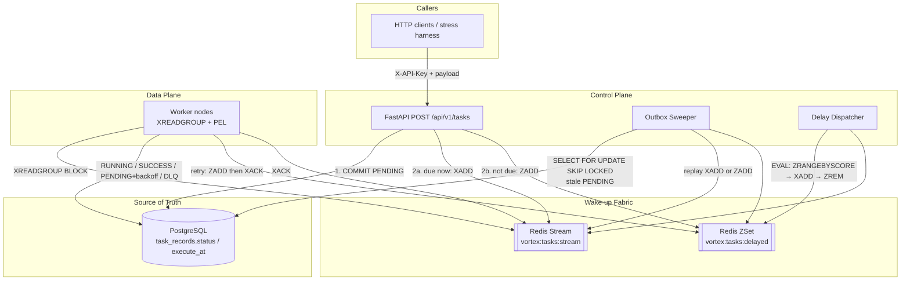

# VortexMQ

**A High-Performance, Multi-Tenant Async Task Queue & Event Pipeline**

多租户异步任务队列与事件管道。PostgreSQL 保存状态，Redis 只负责叫醒执行器。

[English](README.md) · [中文](README.zh-CN.md) · [Technical Whitepaper (zh-CN)](WHITEPAPER.zh-CN.md) · [Freshman lecture notes (zh-CN)](KNOWLEDGE.zh-CN.md)

[](https://www.python.org/)
[](https://fastapi.tiangolo.com/)
[](https://redis.io/docs/latest/develop/data-types/streams/)
[](https://www.postgresql.org/)

---

## Enterprise-Grade Features / 核心特性

**Dual-Write Consistency via Outbox Pattern.** The API commits `PENDING` to PostgreSQL first, then `XADD` / `ZADD` to Redis. If the second write dies, an Outbox Sweeper re-enqueues from the row. Redis is allowed to forget; the database is not.

**Distributed Concurrency Control & Consumer Groups.** Workers join `vortex:workers` and read with `XREADGROUP`. A message sits in exactly one consumer's PEL until `XACK`. Idle PEL entries are reclaimed with `XAUTOCLAIM`.

**High-Precision Time Wheel via Redis ZSet.** `execute_at` in the future is scored into `vortex:tasks:delayed`. A Delay Dispatcher runs a Lua script every second: due members move to the Stream in one atomic hop.

**Self-Healing & Exponential Backoff.** A failed execution increments `retry_count`, writes `next_execute_at = now + base * 2^retry_count`, `ZADD`s the delayed set, then `XACK`s. After three failures the row becomes `DLQ` with the traceback in `error_msg`.

**Graceful Shutdown.** `SIGINT` / `SIGTERM` only set a stop flag. The process stops issuing `XREADGROUP`, finishes the in-flight `RUNNING` task (Postgres write + `XACK`), then closes pools.

---

## Architecture / 架构

Control plane (API, Sweeper, Dispatcher) and data plane (Worker) share two stores and nothing else. They scale independently.



Status machine: `PENDING → RUNNING → SUCCESS`, or `RUNNING → PENDING` (retry) / `DLQ`. Redis never owns that machine. Stream fields are `task_id` (and optionally `tenant_id`); payload lives in JSONB on the row.

---

## Core Design Decisions / 硬核设计抉择

### 1. PostgreSQL is the single source of truth. Redis only wakes workers.

A Stream entry is a hint, not a contract. Persistence, tenant isolation, retry count, `execute_at`, and dead-letter text all have a WAL. Redis AOF helps, but a flush, a failover, or a bad `XACK` still cannot invent a task that was never committed, and cannot erase a row that was.

The publish path is therefore **commit then notify**:

1. Insert `PENDING` and `COMMIT`.
2. `XADD` or `ZADD`. On failure the HTTP handler still returns `201` with `task_id`. The Outbox Sweeper is the repair path.

Workers are at-least-once. `SUCCESS` / `FAILED` / `DLQ` are terminal: a duplicate Stream delivery is `XACK`ed without re-running side effects. A message whose `execute_at` is still in the future is put back on the ZSet and `XACK`ed. Postgres wins the clock.

If you reverse the order (notify then commit), a worker can `XREADGROUP` a `task_id` that is not visible yet. That is a harder bug than a delayed retry.

### 2. `SELECT … FOR UPDATE SKIP LOCKED` for the Outbox scan

Several API replicas each run the Sweeper. A naive `SELECT … FOR UPDATE` serializes them: replica B waits on A's locks, then may `XADD` the same ids.

`SKIP LOCKED` makes the scan a non-blocking claim. A holds a batch; B takes whatever is left. After a successful Redis write the sweeper bumps `updated_at`, so the same row is invisible for the stale window (default 30s). That bump is the lease. The lock is only held for the duration of the transaction that includes the Redis write.

This is the same shape as a Postgres job table. It is not fancy. It is the correct isolation primitive when the Outbox lives in the same database as the tasks.

### 3. Delay Dispatcher uses Lua because three commands are not atomic

Due-task promotion is:

```text
ZRANGEBYSCORE delayed -inf <now> LIMIT 0 N
XADD stream * task_id <id>     # per member
ZREM delayed <id>
```

Two Dispatcher processes (or two API workers after a rolling deploy) can both observe the same members between `ZRANGEBYSCORE` and `ZREM`. You get two Stream messages for one delay. Consumer groups do not help: those are two distinct IDs.

`EVAL` runs the loop on the Redis thread. No other command interleaves. One member is moved once.

Caveat: Redis does not roll back a Lua script that errors mid-loop. Partial `XADD` without `ZREM` means at-least-once into the Stream; the Worker idempotency above covers it. Partial `ZREM` without `XADD` would drop the wake-up. The Sweeper still sees `PENDING` + `execute_at` and will `ZADD` or `XADD` again. That is why the row remains the source of truth even for the time wheel.

On Redis Cluster, both keys in the script must hash to the same slot. Single-node Compose does not care.

---

## Quick Start

```bash
docker compose up -d --build
# or: make up
```

Schema evolution is versioned with **Alembic** (`migrations/`). On a fresh
production database run `python -m alembic upgrade head`. If you already have a
database created by the old scaffold-time `create_all`, run
`python -m alembic stamp head` once and use migrations from then on. The app
boot path keeps `create_all` only as a fallback for local scaffolding.

| Port | Service |
|------|---------|
| 8000 | API (`/docs`, `/metrics`) |
| 8001 | Worker metrics |
| 5432 | PostgreSQL |
| 6379 | Redis |
| 9090 | Prometheus |
| 3000 | Grafana (`admin` / `admin`) |

API keys are no longer seeded on boot. Issue a tenant key (plaintext is printed once):

```bash
python -m app.cli create-tenant default
```

Workers execute **registered handlers only**. Tasks are routed by `task_type`
through `app/worker/registry.py` (`@vortex_registry.register("your.type")`).
`demo.echo`, `demo.noop`, `demo.sleep` and `demo.fail` are built-in sample
handlers (`app/worker/handlers.py`) for smoke tests and load runs. A task whose
type has no handler raises `UnregisteredTaskError` and is taken over by the
retry / DLQ pipeline, so nothing is silently swallowed.

Immediate task (put the printed key into `X-API-Key`):

```bash
curl -sS -X POST http://127.0.0.1:8000/api/v1/tasks \
  -H "Content-Type: application/json" \
  -H "X-API-Key: <your-api-key>" \
  -d "{\"task_type\":\"demo.echo\",\"payload\":{\"hello\":\"world\"}}"
```

Delayed task (ZSet path):

```bash
curl -sS -X POST http://127.0.0.1:8000/api/v1/tasks \
  -H "Content-Type: application/json" \
  -H "X-API-Key: <your-api-key>" \
  -d "{\"task_type\":\"demo.echo\",\"execute_at\":\"2026-08-17T12:00:00Z\",\"payload\":{}}"
```

### Using the Python SDK

A thin client SDK ships in `sdk/python/` so business callers don't hand-roll the
HTTP calls or the DAG JSON. It wraps `httpx` (sync + async) and injects
`X-API-Key` on every request. Require `httpx` (already a dev/test dependency) and
put `sdk/python` on your `PYTHONPATH` (or install it as a package later).

```python
from datetime import datetime, timedelta, timezone

from vortexmq_client import VortexMQClient, Workflow

client = VortexMQClient("http://127.0.0.1:8000", "<your-api-key>")

# 1. Immediate task
task_id = client.submit_task("demo.echo", {"hello": "world"})

# 2. Delayed task (lands in the ZSet until execute_at)
task_id = client.submit_task(
    "demo.echo",
    {"hello": "later"},
    execute_at=datetime.now(timezone.utc) + timedelta(hours=1),
)

# 3. Poll the result: SUCCESS returns result_data; in-flight returns status
result = client.get_task_result(task_id)
print(result["status"], result.get("result_data"))

# 4. Compose a DAG with the fluent builder
wf = Workflow()
node_a = wf.add_node("node_a", "etl.extract", {"source": "db"})
node_b = wf.add_node("node_b", "etl.transform", {}, depends_on=[node_a])

task_ids = client.submit_workflow(wf)  # -> ["<a-task-id>", "<b-task-id>"]
```

Async callers use `AsyncVortexMQClient` with the same methods awaited
(`await client.submit_task(...)`, `await client.get_task_result(...)`,
`await client.submit_workflow(...)`) and `async with`.

The Admin API (task hall / DLQ replay / force cancel / worker monitoring) uses a
separate `X-Admin-Key` header instead of tenant auth. Set `ADMIN_API_KEY` in your
`.env` first:

```bash
# Task hall: keyset cursor pagination (status / tenant_name / tenant_id / created_from / created_to)
curl -sS "http://127.0.0.1:8000/api/v1/admin/tasks?status=DLQ&page_size=20" \
  -H "X-Admin-Key: <your-admin-key>"
#   -> {"items": [...], "total": N, "page_size": 20, "next_cursor": "..."}
# Next page: pass next_cursor back as ?cursor=...; stop when next_cursor is null.

# Replay a DLQ task: back to PENDING and re-wake the Worker
curl -sS -X POST http://127.0.0.1:8000/api/v1/admin/tasks/<task_id>/replay \
  -H "X-Admin-Key: <your-admin-key>"

# Force-cancel a backlog task (PENDING / RUNNING / WAITING; cascades to WAITING children)
curl -sS -X POST http://127.0.0.1:8000/api/v1/admin/tasks/<task_id>/cancel \
  -H "X-Admin-Key: <your-admin-key>"

# Worker monitoring (heartbeat-alive nodes + in_flight load)
curl -sS http://127.0.0.1:8000/api/v1/admin/workers \
  -H "X-Admin-Key: <your-admin-key>"
```

If `ADMIN_API_KEY` is not set, every admin endpoint returns `503` so a mis-deploy
cannot expose the cross-tenant control plane anonymously. Generate a strong key
with `python -c "import secrets; print(secrets.token_urlsafe(48))"`.

Load mix (70% immediate / 20% delayed / 10% poison pills):

```bash
make stress STRESS_ARGS="--api-key <your-api-key>"
# make stress STRESS_ARGS="--api-key <key> --count 2000 --concurrency 100"
```

Worker logs: `make logs-worker`. Stop: `make down`.

---

## Layout

```
app/api/          HTTP, tenant auth via X-API-Key
app/core/         config, async engine, Redis pool, Lua, Prometheus
app/models/       Tenant, TaskRecord
app/services/     submit, Outbox Sweeper, Delay Dispatcher
app/worker/       consumer loop, handler registry, backoff, graceful stop
migrations/       Alembic schema migrations
scripts/          asyncio + aiohttp stress client
```

API process: HTTP + Sweeper + Dispatcher. Worker process: `python -m app.worker`. Do not colocate them if you want the data plane to scale on its own.

---

## Known Limits & Trade-offs

Deliberate ceilings are marked with `ponytail:` comments in the code:

- **Size boundaries**: global HTTP body cap `2 MiB` (`app/core/body_limit.py`,
  works for chunked bodies too), per-task `payload` cap `256 KiB`, handler
  `result_data` cap `1 MiB` (oversize fails the task into retry/DLQ explicitly,
  never silently truncated), per-child XCom injection budget `256 KiB` (excess
  upstream results are dropped with a warning log).
- **Worker concurrency & connections**: in-flight cap per process is
  `WORKER_MAX_IN_FLIGHT` (default 4). Idle `XREADGROUP BLOCK` holds one Redis
  connection per tenant — raise `max_connections` in `app/core/redis.py` when
  the tenant count approaches the pool size.
- **Cancel semantics**: cancelling a `RUNNING` task does not interrupt the running
  handler — external side effects cannot be rolled back and its result is not
  stored. Cancelling `PENDING / WAITING` is safe. `DLQ replay` also revives the
  cascaded-cancelled WAITING descendants; `CANCELED` tasks themselves are not
  replayable (only DLQ is exposed on the admin surface).
- **Retention**: `task_records` has no automatic archive/TTL. The admin task hall
  paginates with an opaque keyset cursor over `(created_at DESC, task_id ASC)` —
  page cost is independent of depth (indexes: `(status, created_at)` for filtered
  views, `(created_at DESC, task_id ASC)` for the unfiltered default). The
  `total` count still scans matching rows on every request; plan an archive job
  for large production datasets.
- **Tenant lifecycle**: only `create-tenant` / `--rotate` exist; decommissioning a
  tenant requires manually cleaning its Redis lanes, delayed ZSet and the
  `{vortex}:tenants` index (PostgreSQL cascades on FK).
- **Observability**: `vortexmq_tasks_total` is labelled by `tenant_id + task_type`;
  the Prometheus series grow linearly with tenant count. The admin console stores
  the `X-Admin-Key` in `localStorage` (prefer HTTPS + CSP, or an httpOnly cookie
  session).
- **Status enum**: `FAILED` currently has no writer (failures go to PENDING retry
  or DLQ) and is kept for backward compatibility with historical rows.
