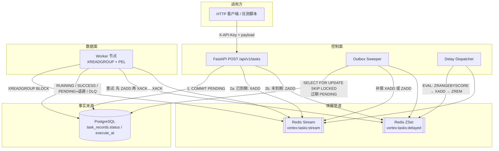

# VortexMQ

**高性能多租户异步任务队列与事件管道**

A High-Performance, Multi-Tenant Async Task Queue & Event Pipeline

PostgreSQL 保存任务状态，Redis 只负责叫醒执行器。

[English](README.md) · [中文](README.zh-CN.md) · [技术白皮书（零基础）](WHITEPAPER.zh-CN.md) · [知识讲义（大一）](KNOWLEDGE.zh-CN.md)

[](https://www.python.org/)
[](https://fastapi.tiangolo.com/)
[](https://redis.io/docs/latest/develop/data-types/streams/)
[](https://www.postgresql.org/)

---

## 核心特性

**基于发件箱模式的双写一致性。** API 先把 `PENDING` 提交进 PostgreSQL，再对 Redis 做 `XADD` / `ZADD`。第二次写入失败时，Outbox Sweeper 按行补偿投递。Redis 丢消息可以修；数据库丢行不行。

**分布式并发控制与消费者组。** Worker 加入 `vortex:workers`，用 `XREADGROUP` 取消息。一条消息在 `XACK` 之前只会出现在某一个消费者的 PEL 里。空闲 PEL 由 `XAUTOCLAIM` 认领。

**基于 Redis ZSet 的高精度时间轮。** 未到期的 `execute_at` 以 Unix 时间戳为 Score 写入 `vortex:tasks:delayed`。Delay Dispatcher 每秒跑一段 Lua：到期 member 一次原子地搬进 Stream。

**自愈与指数退避。** 执行失败则 `retry_count + 1`，写入 `next_execute_at = now + base * 2^retry_count`，`ZADD` 延迟队列，再 `XACK`。失败三次后状态变为 `DLQ`，堆栈记入 `error_msg`。

**优雅停机。** `SIGINT` / `SIGTERM` 只置停机标志。进程停止新的 `XREADGROUP`，把当前 `RUNNING` 任务写完 Postgres 并 `XACK`，再关连接池。

---

## 架构

控制面（API、Sweeper、Dispatcher）与数据面（Worker）只共享两套存储，彼此独立扩缩容。



状态机：`PENDING → RUNNING → SUCCESS`，或 `RUNNING → PENDING`（重试）/ `DLQ`。这台状态机不归 Redis 管。Stream 里只带 `task_id`（可选 `tenant_id`）；载荷在行上的 JSONB。

---

## 硬核设计抉择

### 1. 为什么用 PostgreSQL 做唯一事实来源，Redis 只负责叫醒？

Stream 里的条目是提示，不是契约。持久化、租户隔离、重试次数、`execute_at`、死信堆栈都走 WAL。Redis 开 AOF 也挡不住一次错误的 `XACK`、一次 failover 或一次误删：它变不出从未提交过的任务，也抹不掉已经落库的行。

因此投递顺序是 **先提交，再通知**：

1. 插入 `PENDING` 并 `COMMIT`。
2. `XADD` 或 `ZADD`。第二次失败时接口仍返回 `201` 和 `task_id`，由 Outbox Sweeper 补投。

Worker 是至少一次投递。`SUCCESS` / `FAILED` / `DLQ` 是终态：重复的 Stream 投递只 `XACK`，不再执行副作用。`execute_at` 尚未到期的消息放回 ZSet 再 `XACK`。时钟以 Postgres 为准。

若反过来（先通知再提交），Worker 可能 `XREADGROUP` 到一条事务尚未可见的 `task_id`。那种 bug 比晚几秒重投更难查。

### 2. 如何用 `SELECT … FOR UPDATE SKIP LOCKED` 解决并发扫表？

多个 API 副本各自跑 Sweeper。普通 `SELECT … FOR UPDATE` 会把它们串起来：B 等 A 放锁，然后可能对同一批 id 再 `XADD` 一次。

`SKIP LOCKED` 把扫描变成非阻塞认领。A 锁住一批，B 拿剩下的。Redis 写入成功后 Sweeper 刷新 `updated_at`，该行在 stale 窗口内（默认 30 秒）不会再被扫到。这个时间戳就是租约。行锁只覆盖「带 Redis 写入的那一笔事务」。

这和 Postgres 作业表是同一套隔离手段。Outbox 和任务表在同一个库里时，就该用这个原语。

### 3. 为什么 Delay Dispatcher 必须用 Lua？

到期搬运是三条命令：

```text
ZRANGEBYSCORE delayed -inf <now> LIMIT 0 N
XADD stream * task_id <id>     # 逐条
ZREM delayed <id>
```

两个 Dispatcher（或滚动发布时的两个 API worker）可以在 `ZRANGEBYSCORE` 和 `ZREM` 之间看到同一批 member，于是一条延迟任务进 Stream 两次。消费者组帮不上忙：那是两条不同的消息 ID。

`EVAL` 在 Redis 单线程里跑完整个循环，中间插不进别的命令。一个 member 只被搬走一次。

注意：Lua 中途报错不会回滚已执行的写。只 `XADD` 没 `ZREM` 会变成 Stream 上的至少一次，由 Worker 幂等消化。只 `ZREM` 没 `XADD` 会丢掉这次叫醒。Sweeper 仍能看到 `PENDING + execute_at`，会再次 `ZADD` 或 `XADD`。所以时间轮丢了，行还在。

Redis Cluster 上脚本里的两个 KEY 必须落在同一 hash slot。单机 Compose 没有这个问题。

---

## 快速开始

```bash
docker compose up -d --build
# 或: make up
```

Schema 演进统一走 **Alembic**（`migrations/`）。全新生产数据库先执行
`python -m alembic upgrade head`；由旧脚手架 `create_all` 建出来的库请先执行
一次 `python -m alembic stamp head`，此后一律走版本化迁移。应用启动路径只保留
`create_all` 作为本地脚手架兜底。

| 端口 | 服务 |
|------|------|
| 8000 | API（`/docs`、`/metrics`） |
| 8001 | Worker 指标 |
| 5432 | PostgreSQL |
| 6379 | Redis |
| 9090 | Prometheus |
| 3000 | Grafana（`admin` / `admin`） |

API 不再自动写入演示密钥。签发租户（明文只打印一次）：

```bash
python -m app.cli create-tenant default
```

Worker 只执行**已注册的 Handler**。任务按 `task_type` 经 `app/worker/registry.py`
路由（`@vortex_registry.register("your.type")`）。`demo.echo`、`demo.noop`、
`demo.sleep`、`demo.fail` 是内置示例 Handler（`app/worker/handlers.py`），供冒烟
与压测复用。没有对应 Handler 的任务会抛 `UnregisteredTaskError`，由
重试 / DLQ 管道接管，不会被静默吞掉。

即时任务（把打印出的 Key 填进 `X-API-Key`）：

```bash
curl -sS -X POST http://127.0.0.1:8000/api/v1/tasks \
  -H "Content-Type: application/json" \
  -H "X-API-Key: <your-api-key>" \
  -d "{\"task_type\":\"demo.echo\",\"payload\":{\"hello\":\"world\"}}"
```

延迟任务（走 ZSet）：

```bash
curl -sS -X POST http://127.0.0.1:8000/api/v1/tasks \
  -H "Content-Type: application/json" \
  -H "X-API-Key: <your-api-key>" \
  -d "{\"task_type\":\"demo.echo\",\"execute_at\":\"2026-08-17T12:00:00Z\",\"payload\":{}}"
```

混合压测（70% 即时 / 20% 延迟 / 10% 毒药任务）：

```bash
make stress STRESS_ARGS="--api-key <your-api-key>"
# make stress STRESS_ARGS="--api-key <key> --count 2000 --concurrency 100"
```

Worker 日志：`make logs-worker`。停止：`make down`。

---

## 目录

```
app/api/          HTTP，X-API-Key 租户鉴权
app/core/         配置、异步引擎、Redis 连接池、Lua、Prometheus
app/models/       Tenant、TaskRecord
app/services/     任务提交、Outbox Sweeper、Delay Dispatcher
app/worker/       消费循环、Handler 注册表、退避、优雅停机
migrations/       Alembic 迁移脚本
scripts/          asyncio + aiohttp 压测客户端
```

API 进程：HTTP + Sweeper + Dispatcher。Worker 进程：`python -m app.worker`。数据面要单独扩容时，不要和 API 绑在同一个进程里。
