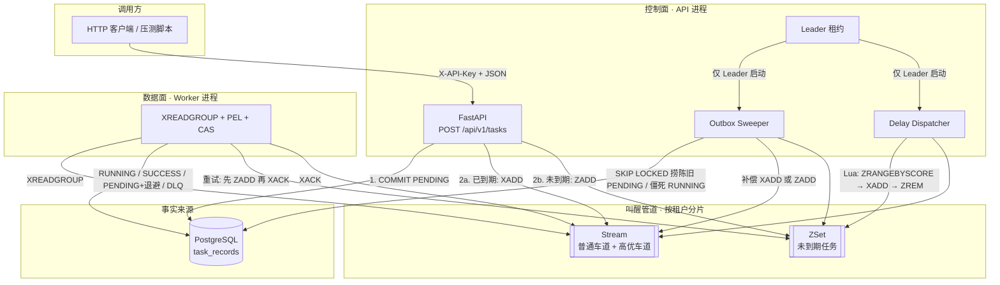

# VortexMQ 技术白皮书

> 面向零基础读者。读完后，你应当能独立画出系统图、讲清一条任务从提交到成功/失败的全过程，并知道每一段逻辑对应仓库里的哪个文件。

---

## 怎么读这份文档

这份白皮书按「先建立直觉，再对上代码」来写。不要求你事先会 Python、PostgreSQL 或 Redis。

建议读法：

1. 第一到第三章：建立「这是什么、为什么要造这个东西」。
2. 第四到第七章：跟着一条任务把整条流水线走完。这是全文的主干。
3. 第八到第十二章：多租户、延迟、失败重试、工作流、选主。这些是主干上的分叉。
4. 第十三章之后：目录地图、配置词典、读源码顺序、故障对照。需要动手或查代码时再翻。

文中第一次出现的术语会立刻解释。文末有术语表，忘记了可以回头查。

---

## 第一章 这个项目解决什么问题

### 1.1 同步请求为什么不够用

想象一个网站接口：「用户点了『发送欢迎邮件』」。最朴素的做法是：接口收到请求后立刻去发邮件，发完再告诉浏览器「好了」。

这会卡住。发邮件可能要 2 秒，短信网关可能要 5 秒，报表可能要 30 秒。HTTP 连接一直占着，用户一直转圈，服务器能同时接待的人数急剧下降。网关抖动时，用户还会反复刷新，同一封邮件可能发出去两次。

更好的做法是：**接口只负责收下这件事并给一张回执，真正干活的人在后台慢慢做。** 用户立刻拿到一个任务编号，过一会儿再来查结果。这就是「异步任务」。

### 1.2 队列是什么

「先收单、后干活」需要一个中间物：已经收下、还没做完的事情要有地方放。这个地方就是队列。

生活里最接近的类比是餐厅：

| 餐厅 | VortexMQ |
|------|----------|
| 客人点单 | 调用方发 HTTP 请求 |
| 服务员写菜单、盖章 | API 把任务写入 PostgreSQL |
| 厨房铃铛响一声 | Redis 叫醒 Worker |
| 厨师按单做菜 | Worker 执行任务 |
| 出餐口贴「已完成」 | 任务状态改成 SUCCESS |
| 三次做砸进问题菜品架 | 进入 DLQ（死信队列） |

关键点：**菜单本身不能只写在铃铛上。** 铃铛停电、被人误按，菜单还在本子上。VortexMQ 把 PostgreSQL 当本子，把 Redis 当铃铛。

### 1.3 一句话定位

VortexMQ 是一套 **多租户异步任务队列**：多个互不相识的调用方（租户）共用同一套服务，各自用自己的钥匙提交任务；任务状态以 PostgreSQL 为唯一事实来源；Redis 只负责「到点了，去干活」。

它还能把多件任务编成一张有依赖关系的图（DAG 工作流），例如「先抽取、再转换、再加载」。父任务成功后才叫醒子任务。

当前仓库里的「干活」是模拟的：Worker 睡 3 秒，假装发了一封邮件。真正接入业务时，把 `execute_simulated_job` 换成你自己的处理函数即可。调度、重试、隔离、补偿这些骨架已经在。

---

## 第二章 读代码前必须建立的五个概念

### 2.1 进程、接口、后台循环

一次 `docker compose up` 会拉起好几个进程。进程就是一台电脑上正在跑的程序副本，彼此内存不共享，只能通过网络或磁盘交换信息。

VortexMQ 里和业务最相关的两个进程：

- **API 进程**（`uvicorn app.main:app`）：对外提供 HTTP。同时在进程内部再跑两个后台循环：Outbox Sweeper、Delay Dispatcher。只有当选 Leader 的那个 API 副本才真正跑这两个循环。
- **Worker 进程**（`python -m app.worker`）：不对外提供业务 HTTP，只从 Redis 取任务、改 PostgreSQL、执行模拟业务。它另开 8001 端口给 Prometheus 抓指标。

「控制面」指 API + Sweeper + Dispatcher；「数据面」指 Worker。两边只共享 PostgreSQL 和 Redis，扩缩容互不影响。

### 2.2 唯一事实来源（SSOT）

**SSOT（Single Source of Truth）** 的意思是：关于「这件事现在到底怎样了」，全系统只认一个地方。

VortexMQ 认定：任务是否存在、当前状态、重试了几次、计划何时执行、失败堆栈、工作流上下游，全部以 PostgreSQL 行上的字段为准。Redis 里的消息只是「去看看这行」的提示。提示丢了可以再发；行丢了任务就真没了。

所以投递顺序永远是 **先提交数据库，再通知 Redis**。反过来的话，Worker 可能拿到一个数据库里还看不见的 `task_id`，那种故障极难查。

### 2.3 至少一次投递（at-least-once）

消息系统常见三种承诺：

- **至多一次**：可能丢，不会重复。
- **恰好一次**：听起来最好，工程上极贵，通常做不到真正的全局恰好一次。
- **至少一次**：可能重复投递，保证最终能送到。

VortexMQ 选至少一次。代价是 Worker 必须幂等：同一条任务被叫醒两次，不能把业务副作用跑两遍。做法是数据库里的 CAS 抢占（见第七章）：只有把状态从 `PENDING` 改成 `RUNNING` 成功的那一个 Worker 才真正执行。

### 2.4 租户

租户不是「用户登录账号」，而是 **资源归属的边界**。公司 A 和公司 B 共用 VortexMQ，A 不能看见 B 的任务，也不能用 B 的钥匙提交。每家公司持有一把 API Key，请求头带 `X-API-Key`。服务端根据钥匙找到租户，后续所有读写都带上这个租户的 ID。

### 2.5 异步（async）

Python 的 `async` / `await` 不是开很多线程，而是：一个线程在等网络（查库、读 Redis、睡一会儿）时，去干别的等待已结束的事。API 和 Worker 整条链路都是异步的，所以一台机器上一个进程就能同时接待很多请求、处理很多「正在等待」的任务。

你暂时只要记住：看到 `await xxx()`，意思是「这里可能要等外部系统，把时间片让出去」。

---

## 第三章 系统鸟瞰

### 3.1 组件清单

本地用 Docker Compose 一次拉起六件事：

| 端口 | 是什么 | 你拿它干什么 |
|------|--------|----------------|
| 8000 | FastAPI | 提交任务、查结果、健康检查、API 指标 |
| 8001 | Worker 指标端口 | Prometheus 来抓 Worker 的计数和耗时 |
| 5432 | PostgreSQL 16 | 任务行、租户、状态机 |
| 6379 | Redis 7（开了 AOF） | Stream、延迟 ZSet、选主锁、心跳 |
| 9090 | Prometheus | 定时去 8000/8001 拉指标 |
| 3000 | Grafana | 把指标画成大盘，默认 `admin` / `admin` |

### 3.2 总流程图

下面这张图就是整份白皮书的地图。后文每一章都在解释其中一条箭头。



### 3.3 状态机

任务在 PostgreSQL 里的状态，Redis 不管：

```text
                    ┌─────────────┐
         提交单任务  │   PENDING   │◄──────────────┐
                    └──────┬──────┘               │
                           │ Worker CAS 抢到       │ 失败且未达上限
                           ▼                      │ （改回 PENDING，execute_at 后移）
                    ┌─────────────┐               │
                    │   RUNNING   │───────────────┘
                    └──────┬──────┘
           成功 / 失败达上限│
              ┌────────────┼────────────┐
              ▼            ▼            ▼
        ┌─────────┐  ┌─────────┐  ┌──────────┐
        │ SUCCESS │  │   DLQ   │  │  FAILED  │
        └─────────┘  └────┬────┘  └──────────┘
                          │
                          │ 工作流：取消仍在等的子孙
                          ▼
                    ┌──────────┐
                    │ CANCELED │
                    └──────────┘

工作流特有：
  有未完成的父任务 ──► WAITING ──► 父任务全 SUCCESS ──► PENDING
```

终态：`SUCCESS`、`FAILED`、`DLQ`、`CANCELED`。再来一条重复的 Redis 消息，Worker 只 ACK，不再执行。

`FAILED` 在枚举里存在，当前 Worker 失败路径实际写入的是「还能重试则回到 `PENDING`，否则进 `DLQ`」，查询接口把 `FAILED` / `DLQ` / `CANCELED` 都当失败类返回。

---

## 第四章 一次即时任务的完整一生

这一章把「点一次接口」拆成可以逐步对照源码的步骤。假设你已经签发了租户钥匙，调用：

```http
POST /api/v1/tasks
X-API-Key: vxk_……
Content-Type: application/json

{
  "task_type": "email.send",
  "payload": { "to": "ops@example.com" }
}
```

### 4.1 请求进门：鉴权

文件：`app/api/deps.py`、`app/crud/tenant.py`、`app/core/security.py`

1. FastAPI 从请求头取出 `X-API-Key`。钥匙不放在 JSON 里，调用方无法伪造 `tenant_id`。
2. 截取明文前 24 位，去 `tenants.api_key_prefix` 找到候选行。bcrypt 哈希带随机盐，不能拿哈希当 SQL 等值查询键。
3. 用 bcrypt 校验整段明文。校验是 CPU 密集的，代码里丢到线程池（`asyncio.to_thread`），避免堵住事件循环。
4. 对不上就 401。对上了，后续所有操作都带着这个 `Tenant` 对象。

库里 **从不存明文钥匙**。签发时终端打印一次，之后只剩哈希。丢了只能 `--rotate` 换一把，旧钥匙立刻失效。

### 4.2 校验请求体

文件：`app/schemas/task.py`、`app/core/payload.py`

Pydantic 检查：

- `task_type` 非空，最长 128。
- `priority` 在 0–100。
- `payload` 顶层禁止出现 `_vortex_sys`（系统留给工作流传递上游结果的命名空间）。
- `payload` 序列化后不能超过 256KiB，防止一条请求把进程内存打爆。超限走 413，不是普通的 422。

通过后才进入业务服务。API 层只认 Schema，不把 ORM 行直接丢给调用方。

### 4.3 先落库，再叫醒

文件：`app/api/v1/endpoints/tasks.py` → `app/services/task_service.py` → `app/crud/task.py`

顺序是刻意的：

1. `create_task` 插入一行：`status=PENDING`，`retry_count=0`，`execute_at` 缺省为现在。`COMMIT`。此时任务已经「存在于世界上」。接口即使在下一步崩溃，这行也还在。
2. `schedule_wakeup` 看 `execute_at`：已到期则 `XADD` 进该租户的 Stream；未到期则 `ZADD` 进该租户的延迟 ZSet。
3. Redis 成功则刷新 `updated_at` 再提交一次。这一戳相当于「投递租约」：Outbox 扫描陈旧 PENDING 时，刚投成功的行不会立刻被当成失败。
4. Redis 失败 **不让接口 500**。日志记下，HTTP 仍然 201，把 `task_id` 还给你。补偿交给 Outbox Sweeper。

为什么 201 而不是 500：对调用方而言，任务已经受理。晚几秒被补投，比让调用方以为失败而重复提交要安全。

### 4.4 Redis 里其实只放了三个字段

文件：`app/core/redis.py` 的 `publish_task`

Stream 消息字段：

- `task_id`
- `tenant_id`
- `priority`

邮件正文、收件人、业务 JSON **不进 Redis**。它们在 PostgreSQL 的 `payload` JSONB 列上。Redis 挂了、消息被裁剪了，只要行还在，就可以再叫醒一次。

优先级 `>= 50`（可配）走高优先级车道 `…:stream:h`，否则走普通车道 `…:stream`。同一租户两条车道的键都带 `{tenant_id}` 花括号，在 Redis Cluster 上会落到同一个槽。

### 4.5 Worker 被叫醒

文件：`app/worker/main.py`

Worker 启动后：

1. 用 `hostname-pid` 生成唯一消费者名。两个进程不能同名，否则 PEL（见 4.6）会互相覆盖。
2. 安装 `SIGINT` / `SIGTERM` 处理器：只置一个停机标志，**不立刻杀死正在跑的任务**。
3. 先排空「属于我的 PEL」：上次这个消费者名崩溃前没 ACK 的消息，优先处理，避免重启后一直占着旧债。
4. 进入主循环：公平轮询每个租户，先读高优车道再读普通车道；没有新消息再去 `XAUTOCLAIM` 认领别人丢掉的空闲消息。

`XREADGROUP` 的 `>` 表示「这个组里还没人读过的新消息」。读到的瞬间，消息进入该消费者的 PEL，别的组员暂时拿不到同一条。

### 4.6 PEL 是什么

**PEL（Pending Entries List）** 是 Redis 消费者组给每个消费者记的「已读未确认清单」。

类比：厨师从窗口拿走一张单，单子还夹在他的夹子上。只有他说「这道菜出了」（`XACK`），夹子上的单才拿掉。厨师突然昏倒（进程崩溃），单子仍在他的夹子上。过了空闲时间（默认 30 秒），别的厨师可以用 `XAUTOCLAIM` 把夹子上的单认领走。

这保证了：一条消息在 ACK 之前，只出现在某一个消费者的 PEL 里。这是「组内不重复消费」的第一道闸。真正防重复执行还要靠下一节的 CAS，因为 Delay Dispatcher 或 Outbox 可能对同一 `task_id` 写入 **另一条** Stream 消息（不同的消息 ID）。

### 4.7 抢执行权：CAS

文件：`app/worker/processor.py` 的 `handle_message`，`app/crud/task.py` 的 `claim_task_for_execution`

Worker 读到消息后：

1. 没有 `task_id`、非法 UUID、库里没有这行：直接 `XACK` 丢掉。毒丸消息必须 ACK，否则会永远堵在 PEL 里。
2. 消息上的 `tenant_id` 必须和行上的一致，防止共享水管上的越权执行。
3. 已经是终态或 `WAITING`：ACK，不跑业务。
4. 行上的 `execute_at` 还没到（以 PostgreSQL / 应用时钟为准，不以 Redis 为准）：放回 ZSet，再 ACK。
5. **CAS 抢占**：一条 `UPDATE … WHERE status = PENDING`（或租约已过期的 `RUNNING`）`SET status = RUNNING`。谁更新到了这一行，谁才执行。另一个 Worker 拿到的是空，直接 ACK 重复消息。

CAS 是 Compare-And-Swap 的习惯叫法：比较当前状态是不是我期望的，是才改。数据库保证这条 UPDATE 是原子的，两个 Worker 不会同时改成功。

### 4.8 执行、写成功、ACK

当前模拟逻辑：睡 3 秒；若 `payload.force_fail == true` 则抛错。

成功路径：

1. `SELECT … FOR UPDATE` 锁住这行。只有仍是 `RUNNING` 才写成 `SUCCESS`，并写入 `result_data`。
2. 若这是工作流节点，同一事务里尝试唤醒下游（见第十章）。
3. `COMMIT` 之后，才对下游做 `schedule_wakeup`。Redis 失败同样交给 Outbox。
4. 最后 `XACK`。

**ACK 必须在 PostgreSQL 写成功之后。** 若先 ACK 再写库，写库失败时消息已经从 PEL 消失，任务会停在 `RUNNING`，只能等 Sweeper 把僵死 RUNNING 改回 PENDING。

成功写入失败则 **不 ACK**，消息留在 PEL，等 `XAUTOCLAIM` 或本消费者重启后重试。

### 4.9 查询结果

```http
GET /api/v1/tasks/{task_id}/result
X-API-Key: vxk_……
```

| 状态 | HTTP |
|------|------|
| SUCCESS | 200，带 `result_data` |
| PENDING / RUNNING / WAITING | 202，仍在处理 |
| DLQ / FAILED / CANCELED | 400，带 `error_msg` |
| 不存在或属于别人 | 404 |

跨租户查询被做成「不存在」，避免用 403 泄露「这个 ID 在系统里有过」。

---

## 第五章 PostgreSQL：本子上到底写了什么

### 5.1 租户表 `tenants`

文件：`app/models/tenant.py`

| 列 | 含义 |
|----|------|
| `id` | UUID 主键。不用自增整数，避免多环境、将来分片时撞号。 |
| `name` | 租户名，全局唯一。签发命令里的 `default`、`alpha` 就是它。 |
| `api_key_hash` | bcrypt 哈希。 |
| `api_key_prefix` | 明文前 24 位，仅用于定位候选行。 |
| `created_at` | 创建时间，带时区。 |

租户删除时，任务行 `ON DELETE CASCADE` 一起清掉。

### 5.2 任务表 `task_records`

文件：`app/models/task.py`

| 列 | 含义 |
|----|------|
| `task_id` | 对外的任务编号，也是主键。 |
| `tenant_id` | 所属租户。 |
| `status` | 状态机，PostgreSQL 原生 ENUM。 |
| `task_type` | 业务类型字符串，例如 `email.send`。将来可按它路由到不同处理器。 |
| `payload` | JSONB 载荷。 |
| `priority` | 0–100，越大越优先。 |
| `retry_count` | 已失败次数。从 0 往上加，到 3 进 DLQ。 |
| `error_msg` | 最近一次堆栈，截断到 8000 字符。 |
| `execute_at` | 计划执行时间。延迟、退避都改这一列。 |
| `workflow_id` | 所属 DAG；独立任务为空。 |
| `upstream_ids` / `downstream_ids` | 父、子任务 UUID 列表（JSONB）。 |
| `result_data` | 成功后的返回值，供下游 XCom 与结果查询。 |
| `created_at` / `updated_at` | 创建与最后更新。`updated_at` 还兼投递租约、RUNNING 租约。 |

索引按真实查询建：租户+状态、状态+优先级+创建时间、状态+更新时间（给 Outbox）、工作流 ID。

### 5.3 为什么时钟以 Postgres / UTC 为准

文件：`app/core/clock.py`

代码里所有「现在」都走 `utcnow()`，读到的时间都 `as_utc()`。naive（不带时区）和 aware（带时区）的 datetime 一旦混用，Python 会直接抛错，或者更糟：静默比错，延迟任务提前或永不执行。

Worker 判断「是否到期」读的是 **行上的 `execute_at`**，不是 Redis ZSet 的 score。ZSet 只是叫醒用的索引。两边短暂不一致时，以行为准：没到点就放回 ZSet。

---

## 第六章 Redis：铃铛、定时器和锁

### 6.1 键布局（为 Cluster 准备）

文件：`app/core/redis.py` 模块注释

Redis Cluster 把键按哈希槽切开。一条 Lua 脚本里碰到的所有 KEY，必须落在同一槽，否则报 `CROSSSLOT`。花括号 `{…}` 里的部分决定槽，叫 Hash Tag。

数据面按租户切开：

```text
{tenant_id}:vortex:tasks:stream      普通车道
{tenant_id}:vortex:tasks:stream:h    高优先级车道
{tenant_id}:vortex:tasks:delayed     延迟 ZSet
```

控制面固定到另一个槽，不和租户数据抢：

```text
{vortex}:tenants           有过投递记录的租户 ID 集合
{vortex}:leader            控制面选主锁
{vortex}:metrics:workers   Worker 心跳 ZSet
```

登记租户用单独的 `SADD`，不能塞进租户 Lua：`{vortex}` 和 `{tenant_id}` 不在同一槽。

### 6.2 Stream：有编号的日志

Redis Stream 可以想成「只能在尾部追加的日志」。每条消息有一个 ID，类似 `1710000000000-0`。

本项目用到的命令：

| 命令 | 作用 |
|------|------|
| `XADD` | 追加一条叫醒消息；带近似 `MAXLEN`，防止只 ACK 不删把磁盘写满。 |
| `XGROUP CREATE` | 为某条 Stream 建消费者组 `vortex:workers`。 |
| `XREADGROUP … >` | 读组内尚未分配的新消息，读完进自己的 PEL。 |
| `XREADGROUP … 0` | 读自己 PEL 里还没 ACK 的。启动排空用这个。 |
| `XACK` | 从 PEL 去掉，表示「我处理完了」。 |
| `XAUTOCLAIM` | 把别人 PEL 里空闲超过阈值的消息改挂到自己名下。 |
| `XLEN` | 近似长度，给监控用。 |

### 6.3 ZSet：按时间排序的等待室

有序集合的每个成员带一个分数。这里分数是 `execute_at` 的 Unix 时间戳。成员格式：`task_id|priority`。

Delay Dispatcher 每秒对每个租户跑一次 Lua：

1. `ZRANGEBYSCORE delayed -inf <now> LIMIT 0 N`：取出已到期的最多 N 个。
2. 按优先级 `XADD` 到普通或高优 Stream。
3. `ZREM` 从等待室拿掉。

为什么必须 Lua：这三步若分成三条普通命令，两个 Dispatcher（滚动发布时很容易出现）可能在 `ZRANGEBYSCORE` 和 `ZREM` 之间看到同一批成员，于是同一任务进 Stream 两次。消费者组帮不上忙——那是两条不同的消息 ID。Lua 在 Redis 单线程里跑完整个循环，中间插不进别的命令。

Lua 中途报错 **不会回滚** 已经执行的写。只 `XADD` 没 `ZREM`：Stream 上多一次叫醒，Worker 幂等消化。只 `ZREM` 没 `XADD`：这次叫醒丢了。Sweeper 仍能看见 `PENDING + execute_at`，会再次 `ZADD` 或 `XADD`。所以时间轮丢了，行还在。

### 6.4 选主锁

文件：`app/core/leader.py`

多个 API 副本时，Sweeper 扫表、Dispatcher 跑 Lua 只需要一个人做。锁是单 Key：

- 抢锁：`SET {vortex}:leader <token> NX PX 10000`（不存在才设，10 秒过期）。
- 续期：Lua 里先确认值仍是我的 token，再 `PEXPIRE`。
- 释放：Lua 里确认是我的 token 再 `DEL`，避免误删别人刚抢到的锁。

这不是学术界的 Redlock。注释写得很清楚：短暂双主窗口（网络分区时两个人都以为自己是 Leader）由 Outbox 的 `SKIP LOCKED` 和 Worker 的 CAS 兜底，不会把状态机撕开。

TTL（10 秒）必须明显大于续约间隔（3 秒）。Leader 挂了，最多约 10 秒后 Standby 能当选。

---

## 第七章 Worker：数据面怎么保证「只跑一次副作用」

### 7.1 主循环在干什么

文件：`app/worker/main.py` 的 `run_worker`

每个循环节拍：

1. 写心跳到 `{vortex}:metrics:workers`（ZSet，score 为当前 Unix 时间）。
2. 若停机标志已置位，跳出，不再拉新任务。
3. 列出活跃租户，轮询读新消息。
4. 这一圈没有新消息，再去认领空闲 PEL。

租户公平轮询：不要让租户 A 的海量普通任务饿死租户 B。每个租户内部先读高优车道。非阻塞探测一整圈都空，才按 `WORKER_BLOCK_MS`（默认 5 秒）睡一会儿，把时间片让出去。

### 7.2 幂等的四道闸

同一 `task_id` 被叫醒多次时，从外到内：

1. **消费者组 PEL**：同一条 Stream 消息 ID 同时只在一个消费者手里。
2. **状态短路**：终态 / `WAITING` 直接 ACK。
3. **CAS**：只有 `PENDING`（或租约过期的 `RUNNING`）能变成 `RUNNING`。
4. **写终态时的行锁**：`SUCCESS` / 重试 / `DLQ` 都 `SELECT FOR UPDATE`，并且要求当前仍是 `RUNNING`。两个 Worker 不能各加一次 `retry_count`。

业务函数本身在模拟实现里没有外部副作用（只 sleep）。你换成「真的发邮件」时，业务层也应当按 `task_id` 做成可重入，作为第五道闸。调度层保证的是「尽量不跑两遍」，不是数学上的零。

### 7.3 失败：指数退避，而不是立刻重试

文件：`processor.py` 的 `_persist_failure`、`compute_next_execute_at`

公式：

```text
next_execute_at = now + WORKER_RETRY_BASE_DELAY_SECONDS * 2^retry_count
```

默认基数 5 秒。失败次数变成 1、2、3 时，等待大约 10 秒、20 秒、40 秒（注意代码里是先 `retry_count + 1` 再代入公式）。第三次失败（`retry_count` 达到 `WORKER_MAX_RETRIES=3`）进入 `DLQ`，堆栈写入 `error_msg`，工作流则级联取消仍为 `WAITING` 的子孙。

退避任务 **先改 PostgreSQL**（`PENDING` + 新的 `execute_at`），**再 `ZADD`，再 `XACK`**。若先 ACK 再写库失败，消息消失、状态仍是 `RUNNING`，会变成僵死任务，由 Sweeper 回收。

### 7.4 优雅停机

默认的 Ctrl+C 会变成 `KeyboardInterrupt`，`asyncio.run` 取消所有任务。正在 `RUNNING` 的那条可能既没写成终态，也没 ACK。

本项目改成协作式退出：

1. 信号只 `stop_event.set()`。
2. 主循环看到标志后停止 `XREADGROUP`。
3. 当前这条 `handle_message` 继续跑完（写 PG + ACK）。
4. 清心跳、关 Redis、关数据库连接池。

Windows 没有 `loop.add_signal_handler`，退回 `signal.signal`，再用 `call_soon_threadsafe` 置位，因为回调可能不在事件循环线程。

`kill -9` 没有机会走这条路。那时靠：PEL + `XAUTOCLAIM`，以及 Sweeper 把过期 `RUNNING` 改回 `PENDING`。

---

## 第八章 Outbox：第二次写入失败时谁来收场

### 8.1 双写问题

「先写库，再写 Redis」不是事务。Postgres 提交了，进程在 `XADD` 前被杀，Redis 里就没有叫醒。若接口因此返回 500，调用方重试会再插一行，变成重复任务。所以接口在 Redis 失败时仍然 201，把「补铃铛」交给后台。

这就是发件箱（Outbox）模式的轻量版：任务表自己兼任发件箱，用 `PENDING + 陈旧的 updated_at` 表示「可能还没叫醒成功」。

### 8.2 扫描怎么避免多副本互抢

文件：`app/crud/task.py` 的 `claim_stale_pending_tasks`，`app/services/outbox.py`

普通 `SELECT … FOR UPDATE`：副本 B 会堵在 A 锁住的行上，A 放锁后 B 可能对同一批再 `XADD` 一次。

`SKIP LOCKED`：遇到已锁的行直接跳过，拿剩下的。选主出现短暂双主时，两个人也不会卡住，也不会认领同一批。

扫描条件：`status = PENDING` 且 `updated_at` 早于「现在减去 30 秒」（可配）。刚投递成功的行刚刷新过 `updated_at`，不会被当成失败。

### 8.3 千万不要握着行锁等 Redis

Sweeper 的事务很短：锁行、刷新 `updated_at`、`COMMIT`，**然后在事务外** 再 `schedule_wakeup`。若持锁期间 `await Redis`，Redis 抖动会把连接池和 Worker 更新一起卡死。

Redis 这次又失败：`updated_at` 已经新了，要再等一个 stale 窗口才会被扫到。这是有意的节流，避免对 Redis 打出重试风暴。

### 8.4 僵死 RUNNING

Worker 被 `kill -9`，且恰好 Redis 的 PEL 也丢了（极少见，例如误删 Stream），`XAUTOCLAIM` 救不回来。行会停在 `RUNNING`。

Sweeper 第二段：捞 `RUNNING` 且 `updated_at` 超过 `WORKER_CLAIM_IDLE_MS`（默认 30 秒）的行，改回 `PENDING` 再叫醒。阈值必须不小于 Worker 的认领空闲时间，否则会把仍在执行的长任务当成僵尸，两个人同时跑。

模拟任务睡 3 秒，30 秒窗口足够。你若换成跑几分钟的作业，必须同步加大这两个配置。

---

## 第九章 延迟任务与高精度时间轮

### 9.1 提交时的分流

`execute_at` 为空或已过去 → Stream。  
`execute_at` 在未来 → 该租户的 ZSet，score 为时间戳。

HTTP 示例：

```json
{
  "task_type": "delay.wakeup",
  "execute_at": "2026-08-18T16:00:00Z",
  "payload": {}
}
```

### 9.2 为什么不靠扫 PostgreSQL 做定时

每秒 `SELECT … WHERE execute_at <= now()` 在任务量大时会打满数据库。ZSet 按分数范围取前 N 条是 O(log N + M)，专门干这个。PostgreSQL 仍保存 `execute_at`，作为 Redis 丢失后的补偿依据。

### 9.3 Dispatcher 与 Leader

文件：`app/services/delay_dispatcher.py`、`app/services/control_plane.py`

API 进程的 lifespan 拉起 `run_control_plane`：每隔 3 秒续约或抢锁。当选才启动 Sweeper 和 Dispatcher 两个 `asyncio.Task`；失锁就 cancel 掉，进入 Standby。`/health` 的 `role` 字段就是 `leader` 或 `standby`。

Dispatcher 每秒对每个登记过的租户 `EVAL` 一次 Lua。批量默认 100。到期任务多时，下一秒继续搬，不会一次搬空把 Stream 打爆。

---

## 第十章 DAG 工作流

### 10.1 它是什么

有时一件事拆成多步，且步与步有依赖：「B 必须等 A 成功」。把步骤画成有向无环图（DAG：Directed Acyclic Graph，有向、没有环）。有环意味着互相等待，永远做不完。

一次请求提交整张图：

```json
{
  "nodes": [
    { "node_id": "extract", "task_type": "etl.extract", "payload": {} },
    { "node_id": "transform", "task_type": "etl.transform", "depends_on": ["extract"] },
    { "node_id": "load", "task_type": "etl.load", "depends_on": ["transform"] }
  ]
}
```

`node_id` 只在这一次请求里当小名。入库后换成真正的 `task_id`。

### 10.2 提交时做什么

文件：`app/services/workflow.py` 的 `submit_workflow`

1. `node_id` 必须唯一。
2. Kahn 算法拓扑排序：反复取出入度为 0 的点。若结束后还有剩余，就是有环，HTTP 400。引用了不存在的节点、自己依赖自己，同样 400。
3. 同一事务插入全部节点：没有 `depends_on` 的是 `PENDING`（起始任务），其余是 `WAITING`。
4. `COMMIT` 后只叫醒起始 `PENDING`。`WAITING` 不进 Redis，Worker 也不会执行它们。

图的边存在每行的 `upstream_ids` / `downstream_ids` 上，不另建一张边表。Redis 仍然只叫醒已经变成 `PENDING` 的节点。

### 10.3 成功之后如何唤醒下游

文件：`awaken_downstream`

父任务在同一事务里写成 `SUCCESS` 后：

1. 按 UUID 字符串排序去锁每个子任务（和取消子孙用同一把顺序，避免 AB-BA 死锁）。
2. 只锁子任务，不锁上游：上游已是终态，再锁容易和「对方正在更新自己那一行」形成环。
3. 子任务必须仍是 `WAITING`，且租户一致。
4. 读齐所有上游的状态。必须全部 `SUCCESS` 才把子任务改为 `PENDING`。
5. 把上游的 `result_data` 注入子任务 payload 的 `_vortex_sys.upstream_results`。这叫 XCom（交叉通信）：下游能读到上游的产出，又不会覆盖用户自己的业务字段。

并发：B 依赖 A 和 C，A、C 几乎同时成功。两个 Worker 都会尝试唤醒 B。因为 `SELECT B FOR UPDATE`，后来者会等到锁释放，看到 B 已经是 `PENDING` 就跳过。若不加锁，双方都可能 `XADD` 一次。

本事务里刚写的父任务 SUCCESS，后续 SELECT 能看见自己的写入（先 `flush`）。另一方若尚未提交，这边会看到对方仍非 SUCCESS，于是不唤醒，把机会留给后提交的那一方。这是正确的：不能在上游还没提交时提前放行。

事务提交后，才对已变为 `PENDING` 的子任务 `schedule_wakeup`。

### 10.4 失败如何蔓延

父任务进入 `DLQ` 时，`cancel_descendants` 从它出发 BFS 全部直接/间接下游，把仍为 `WAITING` 的标为 `CANCELED`。已经在跑或已经成功的不管。先无锁收集子孙（边在提交后不再变），再按同样的 UUID 顺序加锁更新。

---

## 第十一章 多租户隔离清单

隔离不是靠「调用方自觉不传别人的 ID」，而是每一层都强制：

| 层 | 做法 |
|----|------|
| 入口 | 身份只来自 `X-API-Key`，body 里没有 `tenant_id`。 |
| 查询 | `get_task_for_tenant` 带两个条件，跨租户当 404。 |
| Redis 键 | Stream / ZSet 按 `{tenant_id}` 分片，租户之间不是同一条队列。 |
| Worker | 消息 `tenant_id` 必须等于行上的 `tenant_id`。 |
| XCom | 读上游快照强制带本任务的 `tenant_id`。 |
| 唤醒 / 取消 | 子任务租户必须与父任务相同。 |
| 公平性 | Worker 按租户轮询，避免大户饿死小户。 |
| 优先级 | 只在租户内部生效：紧急任务走 `:h` 车道，不让普通任务堵住。 |

payload 体积上限、禁止 `_vortex_sys` 顶层键，属于「别让一个租户把进程打崩 / 冒充系统字段」。

---

## 第十二章 可观测性

### 12.1 指标从哪来

文件：`app/core/metrics.py`、`prometheus.yml`

| 指标 | 类型 | 含义 |
|------|------|------|
| `vortexmq_tasks_total` | Counter | 按 `success` / `failed` / `dlq`、租户、任务类型累加。`failed` 表示将重试，不是终态失败。 |
| `vortexmq_task_duration_seconds` | Histogram | Worker 执行耗时分布。模拟任务大约 3 秒，会落在 3–4 秒的桶里。 |
| `vortexmq_queue_size` | Gauge | `stream` 与 `delayed` 当前堆积。抓取时从 Redis 实时求和。 |
| `vortexmq_active_workers` | Gauge | 心跳仍有效的 Worker 数。过期成员先 `ZREMRANGEBYSCORE` 再计数。 |

队列深度和存活 Worker 数是 **集群全局状态**，不能在每个进程里 `inc/dec`：多副本会各记一份。所以 Gauge 在 API 的 `/metrics` 被抓取时，现查 Redis 再 set。

Worker 自己另开 8001，用 `prometheus_client.start_http_server`，不经过 FastAPI。Prometheus 配置里写的是 Docker DNS 名 `api:8000`、`worker:8001`，不要写 `localhost`（那会指向 Prometheus 容器自己）。

### 12.2 Grafana

预置大盘 `grafana/dashboards/vortexmq.json`：活跃 Worker、Stream/延迟堆积、每分钟任务速率、耗时分位。Compose 会自动配好 Prometheus 数据源。

压测脚本按 70% 即时 / 20% 延迟 / 10% 毒药发请求，就是为了同时点亮这几条曲线。

---

## 第十三章 仓库目录地图

读代码时按这个表找人：

```text
app/
  main.py                 FastAPI 入口：建表、连 Redis、拉起控制面选主
  cli.py                  python -m app.cli create-tenant
  core/
    config.py             全部环境变量
    database.py           异步引擎、Session、启动时补列
    redis.py              键布局、XADD/ZADD、到期搬运 Lua
    leader.py             控制面租约
    security.py           API Key 生成与 bcrypt
    payload.py            载荷体积与保留键
    enums.py              任务状态（给 Schema/Model/Service 共用）
    clock.py              UTC 规范化
    metrics.py            Prometheus 打点
    bootstrap.py          签发租户
  api/
    deps.py               X-API-Key → Tenant
    v1/router.py          挂载 /tasks、/workflows
    v1/endpoints/tasks.py
    v1/endpoints/workflows.py
  models/                 ORM：Tenant、TaskRecord
  schemas/                请求响应，不暴露 ORM
  crud/                   SQL：插入、SKIP LOCKED、CAS
  services/
    task_service.py       单任务：落库 + 叫醒
    workflow.py           DAG：环检测、唤醒、取消
    outbox.py             补偿扫表
    delay_dispatcher.py   每秒 EVAL
    control_plane.py      Leader 才跑上面两个
  worker/
    main.py               消费循环、信号、公平轮询
    processor.py          单条消息：CAS、执行、退避、ACK
scripts/stress_test.py    混合压测客户端
grafana/                  预置大盘与数据源
prometheus.yml
docker-compose.yml
```

分层习惯：`endpoints` 不写 SQL；`crud` 不发 Redis；`services` 编排「库 + 队列」；`worker` 是独立进程，不加载 FastAPI 路由。

---

## 第十四章 配置词典

文件：`app/core/config.py`、`.env.example`

| 变量 | 默认 | 含义 |
|------|------|------|
| `DATABASE_URL` | 本地 postgres | 必须带 `postgresql+asyncpg://` 才能走异步驱动。 |
| `REDIS_URL` | `redis://localhost:6379/0` | Redis 连接。 |
| `REDIS_KEY_PREFIX` | `vortex` | 控制面 Hash Tag，不要自己加花括号。 |
| `REDIS_STREAM_KEY` / `REDIS_DELAYED_KEY` | `vortex:tasks:stream` / `delayed` | 数据面键后缀，前面还会加 `{tenant_id}:`。 |
| `REDIS_CONSUMER_GROUP` | `vortex:workers` | 消费者组名。 |
| `REDIS_STREAM_MAXLEN` | 100000 | Stream 近似裁剪上限。 |
| `REDIS_PRIORITY_HIGH_THRESHOLD` | 50 | 优先级大于等于该值走高优车道。 |
| `WORKER_BLOCK_MS` | 5000 | 一轮租户都空时的休眠。也让 Ctrl+C 有机会被看到。 |
| `WORKER_CLAIM_IDLE_MS` | 30000 | PEL 空闲多久可被认领；同时是 RUNNING 租约。 |
| `WORKER_MAX_RETRIES` | 3 | 第 3 次失败进 DLQ。 |
| `WORKER_RETRY_BASE_DELAY_SECONDS` | 5 | 退避基数。 |
| `OUTBOX_SWEEP_INTERVAL_SECONDS` | 10 | Sweeper 每隔多久扫一次。 |
| `OUTBOX_STALE_SECONDS` | 30 | PENDING 多久没更新算投递失败。 |
| `OUTBOX_BATCH_SIZE` | 20 | 每轮最多认领多少行。 |
| `DELAY_DISPATCH_INTERVAL_SECONDS` | 1 | Dispatcher 节拍。 |
| `DELAY_DISPATCH_BATCH_SIZE` | 100 | 每租户每拍最多搬运条数。 |
| `CONTROL_LEADER_TTL_MS` | 10000 | Leader 锁过期。 |
| `CONTROL_LEADER_RENEW_SECONDS` | 3 | 续约间隔，必须明显小于 TTL。 |
| `WORKER_METRICS_PORT` | 8001 | Worker 指标端口。 |
| `WORKER_HEARTBEAT_TTL_SECONDS` | 15 | 心跳超过该秒数不算活着。 |

改「任务执行很慢」时：同步加大 `WORKER_CLAIM_IDLE_MS` 和 Sweeper 回收 RUNNING 的窗口，否则活任务会被当成僵尸重跑。

---

## 第十五章 动手：从零跑通

环境要求：Docker、Python 3.10+（压测和签发钥匙在宿主机跑）。Windows 上 `make` 需要 Git Bash 或另装 Make；没有 Make 就直接用 `docker compose`。

```bash
docker compose up -d --build
```

签发租户（明文只出现一次，立刻复制）：

```bash
python -m app.cli create-tenant default
```

提交即时任务（把钥匙填进去）：

```bash
curl -sS -X POST http://127.0.0.1:8000/api/v1/tasks \
  -H "Content-Type: application/json" \
  -H "X-API-Key: <你的钥匙>" \
  -d "{\"task_type\":\"email.send\",\"payload\":{\"to\":\"ops@example.com\"}}"
```

大约 3 秒后查结果：

```bash
curl -sS http://127.0.0.1:8000/api/v1/tasks/<返回的 task_id>/result \
  -H "X-API-Key: <你的钥匙>"
```

交互式文档：浏览器打开 `http://127.0.0.1:8000/docs`。Grafana：`http://127.0.0.1:3000`。

毒药任务（观察退避与 DLQ）：payload 里加 `"force_fail": true`。Worker 日志：`docker compose logs -f --tail=200 worker`。

混合压测：

```bash
python scripts/stress_test.py --api-key <你的钥匙> --count 2000 --concurrency 100
```

停掉容器但保留数据卷：`docker compose down`。

---

## 第十六章 推荐读源码顺序

按这个顺序打开文件，和第四到第十章对照，比按目录字母顺序轻松：

1. `app/core/enums.py` — 状态机只有七个值。
2. `app/models/task.py`、`app/models/tenant.py` — 本子上的列。
3. `app/schemas/task.py` — 调用方能看到的字段。
4. `app/api/deps.py` → `endpoints/tasks.py` → `services/task_service.py` — 一次 POST 的路径。
5. `app/core/redis.py` — 先读模块顶部的键布局注释，再读 `schedule_wakeup` 和 Lua。
6. `app/worker/processor.py` — 一条消息的全部命运。这是数据面的核心。
7. `app/worker/main.py` — 循环、信号、公平轮询。
8. `app/services/outbox.py`、`crud/task.py` 里两个 `claim_stale_*` 和 `claim_task_for_execution`。
9. `app/core/leader.py`、`services/control_plane.py`、`services/delay_dispatcher.py`。
10. `app/services/workflow.py` — 环检测、唤醒、取消；注释写了并发与死锁，值得细读。
11. `app/core/metrics.py`、`docker-compose.yml` — 进程如何拼在一起。

读到「为什么先 COMMIT 再 XADD」「为什么 ACK 在写库之后」「为什么 Lua 而不是三条命令」时，回头看 README 里的「硬核设计抉择」三节，和这份白皮书第六、八章是同一件事的两种详细程度。

---

## 第十七章 故障对照：出了什么事、系统靠什么修

| 现象 | 系统行为 |
|------|----------|
| `XADD` 失败，库已提交 | 接口仍 201；最多约 30+10 秒后 Sweeper 补投。 |
| Worker 处理到一半进程被杀 | 消息留在 PEL；30 秒后别人 `XAUTOCLAIM`；CAS 允许过期 RUNNING 被重新抢成 RUNNING。 |
| Worker `kill -9` 且 PEL 丢了 | Sweeper 把过期 RUNNING 改回 PENDING 再叫醒。 |
| 同一 task_id 进 Stream 两次 | CAS 只有一次成功；另一次 ACK 空跑。 |
| 延迟任务被提前 XADD | Worker 看行上 `execute_at`，没到点放回 ZSet。 |
| Lua 只 XADD 没 ZREM | 至少一次叫醒；幂等消化。 |
| Lua 只 ZREM 没 XADD | Sweeper 按行再 ZADD/XADD。 |
| 两个 API 都以为自己是 Leader | SKIP LOCKED 分批；CAS 防双跑；最多重复叫醒，不撕状态。 |
| 调用方用别人的 Key 查 task_id | 404。 |
| payload 带 `_vortex_sys` | 校验失败。 |
| payload 超过 256KiB | 413。 |
| 工作流有环 | 400，一行都不入库。 |
| 上游进 DLQ | 子孙 WAITING → CANCELED。 |
| Ctrl+C | 做完当前条再退出。 |
| Stream 无限增长 | `XADD` 近似 MAXLEN 裁剪；裁掉的是已处理历史，行仍在 PG。 |

---

## 第十八章 当前边界（读代码时不要误解）

1. **业务执行是模拟的。** `execute_simulated_job` 睡 3 秒。接真实业务时在这里分支 `task_type`，并自行保证副作用可重入。
2. **建表用 `metadata.create_all` 加一串 `ALTER … IF NOT EXISTS`。** 适合本地脚手架。生产应换成 Alembic 迁移，避免多副本同时 ALTER。
3. **没有管理后台 UI。** 查任务走 HTTP；看吞吐走 Grafana。
4. **单条任务没有取消 API。** `CANCELED` 只用于工作流上游失败后的级联。
5. **选主不是跨机房的共识算法。** 依赖 Redis 单 Key 租约 + 业务层幂等。
6. **Compose 是单机 Redis。** 键布局已经按 Cluster 的 Hash Tag 写好；真上 Cluster 时，不要把不同槽的键写进同一条 Lua。
7. **`FAILED` 状态在枚举里，主路径失败是 PENDING 重试或 DLQ。** 查询接口仍把它列为失败类，以免旧数据或将来手工改状态时没有出口。

---

## 附录 A 术语表

| 词 | 含义 |
|----|------|
| 异步任务 | 接口先回执、后台再执行的工作项。 |
| 队列 | 已受理、未完成事项的存放处。本项目里「存放」在 PostgreSQL，「叫醒」在 Redis。 |
| SSOT | 唯一事实来源。这里是 PostgreSQL 行。 |
| 租户 | 一把 API Key 对应的资源边界。 |
| Stream | Redis 的追加日志，用来即时叫醒。 |
| ZSet | Redis 有序集合，按执行时间排序的等待室。 |
| 消费者组 | 一组 Worker 共享一条 Stream，每条消息只进其中一个 PEL。 |
| PEL | 已读未 ACK 的清单。 |
| XACK | 从 PEL 移除，表示处理完成。 |
| XAUTOCLAIM | 认领别人 PEL 里空闲太久的消息。 |
| Outbox | 发件箱：库已提交、通知可能失败时的补偿扫描。 |
| SKIP LOCKED | 遇锁跳过，不阻塞，用于多实例分批认领。 |
| CAS | 用 UPDATE … WHERE 期望状态 实现的抢占。 |
| 指数退避 | 失败后等待时间按 2 的幂拉长。 |
| DLQ | Dead Letter Queue，死信：放弃自动执行、留待人看。 |
| DAG | 有向无环图，工作流的形状。 |
| Kahn 算法 | 按入度消点来检测环并给出拓扑序。 |
| XCom | 上游结果注入下游 payload 的系统字段。 |
| Hash Tag | Redis 键里 `{…}`，决定 Cluster 槽。 |
| Leader | 持有控制面锁、唯一跑 Sweeper/Dispatcher 的 API 副本。 |
| 控制面 / 数据面 | 受理与补偿 vs 真正执行；进程分离。 |
| 幂等 | 同一操作做两次，效果与做一次相同。 |
| 至少一次 | 保证能送到，允许重复，靠幂等消化。 |
| AOF | Redis 把写命令追加到文件，重启可回放。仍不能替代 PostgreSQL 当 SSOT。 |
| Gauge / Counter / Histogram | Prometheus 三类指标：当前值、只增计数、分布。 |

---

## 附录 B HTTP 一览

| 方法 | 路径 | 作用 |
|------|------|------|
| POST | `/api/v1/tasks` | 提交单任务，201 |
| GET | `/api/v1/tasks/{task_id}/result` | 查结果，200/202/400/404 |
| POST | `/api/v1/workflows` | 提交 DAG，201 或 400 |
| GET | `/health` | 探活；`role` 为 leader/standby |
| GET | `/metrics` | Prometheus 文本 |
| GET | `/docs` | OpenAPI 交互文档 |

Worker 进程：`GET http://127.0.0.1:8001/metrics`。

签发钥匙不走 HTTP：`python -m app.cli create-tenant <name> [--rotate]`。

---

读到这里，你已经具备独立看懂本仓库的地图：任务是行，Redis 是铃铛，Worker 是厨师，Sweeper 补漏响的铃，Dispatcher 看定时器，工作流是一张不许有环的菜单。接下来打开 `app/worker/processor.py`，对着第四章逐步下断点，会比再读一遍文档更快形成肌肉记忆。
